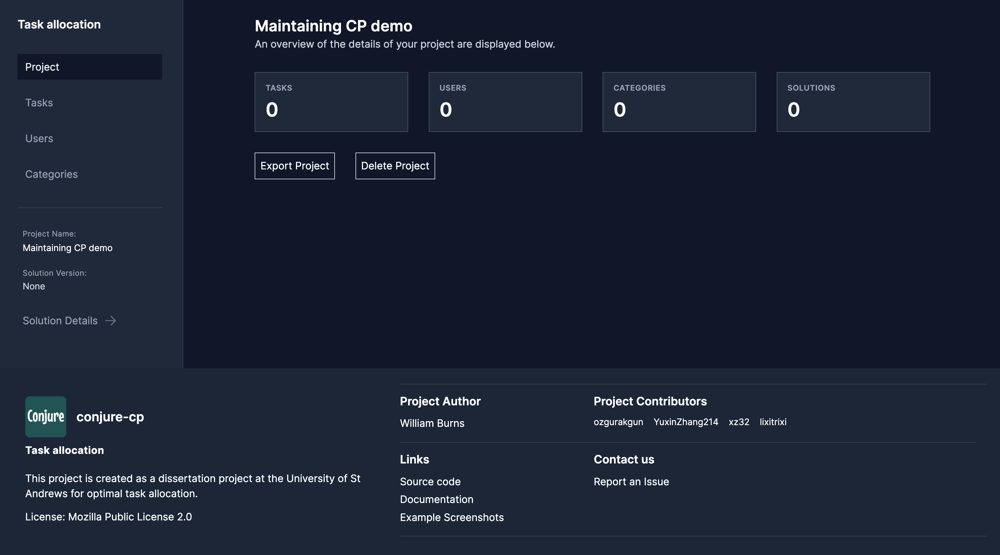

# Task allocation

## Description

Simple user interface for workload planning paired with a backend constraint programming model to find optimal and balanced workloads for users.

Created as a dissertation project at the University of St Andrews.

## Running Instructions

Requires an environment with NodeJS and NPM installed.

#### Running in Production

To start the production server, use the following command:

1. Install dependencies

`npm install`

2. Build

`npm run build`

3. Run

`npm run start`

The application will now be available at /task-allocation.

#### Running in Development

To start the development server, use the following command:

`npm run dev`

This will start the application in development mode. Open http://localhost:3000 to view the application in the browser. The page will reload if you make edits.

## Testing

#### Run E2E Tests

First, start the server

```bash
npm run build
npm run dev
```

and then open another terminal to run

```bash
npm run e2e:headless
```

#### Run Component Tests

```bash
npm run component:headless
```

#### Or

```bash
npm run cypress
```

## User Interface

Below are some screenshots of the project UI:

### Home Page


This is the homepage with no existing project

### Project Page



This is the project page showing the project details

## Example GIFs

### Create new project


Create a new project named **Project Management System**

### Create new category


Create a new category named **Planning**

### Create new task


Create a new task named **Design the database schema** under the **Planning** category

### Create new user


Create a user named **John Smith** managing the **Planning** tasks. He prefers to take over the **Design database schema** task.

## License

This project is licensed under the Mozilla Public License 2.0. For full license information, please see the [LICENSE](./LICENSE) file in the repository.
